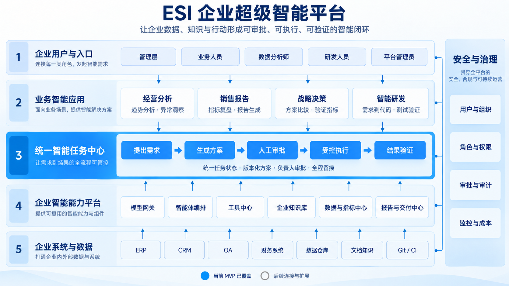
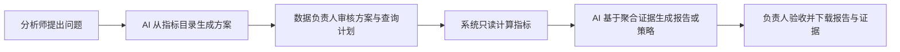

# ESI · 企业超级智能平台 v0.4

ESI 是前后端分离的企业内部超级智能平台。当前包含“研发任务”和“经营分析”两个场景，共用账号、角色、审批、执行、验证、审计这套治理底座。当前面向一个企业内的小团队，不是跨企业 SaaS 多租户系统。



## 已实现

- 登录、退出、初始密码强制修改、个人改密、管理员重置密码。
- 系统管理员和普通成员；项目内负责人、开发者、只读成员。
- 项目、任务、方案、结果、日志和 SSE 的后端权限检查。
- 账号停用及系统角色变更撤销会话；实时流持续复核权限。
- 任务创建人、方案批准人、结果验收人及操作审计。
- AI 只读方案分析、版本化批准、Git worktree 代码变更、有限自动修复；单任务可覆盖最多 6 个已授权仓库。
- 默认 Docker 验证环境，禁网、限制资源，仅挂载当前工作区。
- SQLite / CSV 经营数据源，以及白名单主机上的只读 HTTPS JSON 接口；独立数据角色和受控连接配置。
- 可复用指标口径、AI 分析方案、负责人版本化审批、只读聚合执行；单任务可关联最多 6 个数据源。
- 经营报告与战略建议，支持 Markdown 报告和 CSV 指标证据下载。
- 原始明细不发送给模型；模型只接收指标目录和系统计算的聚合结果。
- 企业系统目录、依赖关系、资源绑定、带来源的人工知识条目和统一指标术语。
- 研发与分析任务的步骤状态，以及分析报告中的结构化建议、员工分配与执行反馈。
- SQLite WAL 持久化、多用户同时访问、单 Worker 串行执行任务。

## 快速启动（本机开发）

要求 Python 3.9+、Node.js 22+、Git。执行验证另需 Docker 和预先准备的镜像。

```bash
python3 -m venv backend/.venv
backend/.venv/bin/pip install -r backend/requirements.lock.txt
npm --prefix frontend ci
cp .env.example .env
PYTHONPATH=backend backend/.venv/bin/python -m app.manage
./scripts/start.sh
```

已存在 `.env` 时不要覆盖，按 `.env.example` 补充新增配置。

管理员初始化命令不提供公开注册入口，也不覆盖已有账号。首次执行生成随机临时密码，保存在 `runtime/bootstrap-admin.txt`（权限 0600），用户名为 `admin`。在工作台首次登录后必须改密，改密后凭据文件自动清除。请妥善保管个人密码。

工作台：http://127.0.0.1:5173

初始化时，旧版本项目和任务归初始管理员管理，数据保留；缺少审批人身份的旧排队任务需要重新批准。部署升级前请备份整个数据库和工作区；停止旧 API/Worker 后再运行初始化。

## 权限规则

| 操作 | 系统管理员 | 项目负责人 | 开发者 | 只读成员 |
|---|---|---|---|---|
| 创建/停用账号、重置密码、系统审计 | 是 | 否 | 否 | 否 |
| 接入服务器仓库、配置验证命令 | 是 | 否 | 否 | 否 |
| 查看项目内需求、代码和日志 | 所有项目 | 所属项目 | 所属项目 | 所属项目 |
| 分配项目成员 | 是 | 所属项目 | 否 | 否 |
| 创建任务 | 是 | 是 | 是 | 否 |
| 修改方案、取消任务 | 是 | 项目内全部 | 自己创建的任务 | 否 |
| 批准方案、验收结果 | 是 | 是 | 否 | 否 |

普通账号默认无项目访问权，由管理员或项目负责人添加到项目。项目负责人不能自行移除或降级自己；系统不能停用或降级最后一位管理员。所有系统管理员可访问所有项目。

跨仓库研发任务要求创建人在每个目标项目具备开发者权限，审批人在每个项目具备负责人权限。跨数据源分析任务要求创建人在每个数据源具备分析师权限，审批人在每个数据源具备数据负责人权限；查看任务也需要对所有关联资源有访问权。系统目录中的条目只有拥有全部关联资源读取权限的成员可以看到。

目前允许负责人批准自己创建的任务，未实现强制双人复核。后台执行会重新检查创建人的开发权限、批准人的负责人权限、账号状态和方案版本，权限撤销后停止后续步骤；已发生的文件变更不会自动回滚。

数据源使用另一套角色：数据负责人可配置指标、分配成员、审批和验收；分析师可查看结构并创建自己的分析任务；只读成员可看报告和证据。系统管理员视为所有数据源的数据负责人。数据源角色与项目角色互不继承。

## 经营分析流程



管理员先在“数据与指标”接入经过批准目录中的 SQLite 或 CSV 文件，再为业务人员分配数据角色。数据负责人按表、聚合方式、数值列、日期列和允许维度定义指标。分析师在“经营分析”提出问题并选择经营报告或战略建议，Worker 生成方案和结构化查询计划。只有数据负责人批准当前版本后，Worker 才会打开文件并计算指标；执行前还会重新检查创建人、批准人和方案版本。

分析任务可以选择多个数据源。模型规划时看到各数据源的指标目录和已关联的统一指标定义；执行时每个指标只在所属数据源计算，结果带数据源名称。负责人可编辑方案文字及结构化指标计划，保存后版本加一并重新审批。报告可附结构化行动建议，由数据负责人分配给有权限的员工，员工或负责人填写采纳状态及实际结果。

查询由后端根据指标定义生成，模型不能提供 SQL、文件路径或原始字段。SQLite 使用只读连接；CSV 逐行聚合。每个指标最多返回 200 个分组，单任务最多 500 个聚合结果。模型生成最终报告时只看到问题、指标口径、批准方案和聚合证据。

生成体验数据：

```bash
python3 scripts/create_sales_demo.py
```

脚本输出 `runtime/sales-demo.db` 及推荐指标。在“数据与指标”中接入该路径，表名使用 `orders`。默认允许目录就是 `runtime/`；生产环境应设置 `ESI_DATA_ROOTS` 为专门的只读数据交换目录，多个目录用英文逗号分隔。

### 只读 HTTPS JSON 数据连接器

管理员先在服务端配置允许的主机名及可选的 Bearer 令牌，再在“数据与指标”选择“HTTPS JSON 接口”：

```dotenv
ESI_CONNECTOR_HOSTS=api.example.internal,warehouse.example.internal
ESI_CONNECTOR_TOKEN_ORDERS=由企业密钥管理系统注入的令牌
```

连接器只向白名单主机发起 HTTPS GET，不跟随重定向。接口需要返回 JSON 对象数组，或 `{"data":[...]}` / `{"items":[...]}`；每行只支持扁平简单值。单次响应上限 8 MB、20,000 行、64 列。访问令牌只从 `ESI_CONNECTOR_TOKEN_` 前缀的服务端环境变量读取，不保存到数据库，也不传给模型。接口读取发生在指标配置及任务执行时；目前不支持分页、增量同步或写回业务系统。

## 企业系统与知识

管理员在“企业系统与知识”登记系统，将已有 Git 项目或数据源绑定到系统，并录入依赖关系。负责人可以添加带来源的业务知识；有权限的成员可以搜索。新建研发任务时，界面会按系统依赖提示已授权的相关仓库，由创建人决定是否纳入任务。研发规划会读取目标项目所属系统的知识和依赖，经营分析会读取指标关联的统一口径。目录和依赖目前由管理员维护，不会自动扫描企业网络或推断系统关系。

统一指标口径由管理员创建，数据负责人将各数据源的现有指标关联到同一术语。关联只提供共同语义和来源展示，跨源聚合仍逐指标计算；目前没有自动单位换算、实体对齐或跨源 SQL JOIN。

## 模型配置

在服务器 `.env` 设置：

```dotenv
MODEL_BASE_URL=https://api.openai.com/v1
MODEL_NAME=你的模型名称
MODEL_API_KEY=你的服务端密钥
```

使用兼容 Chat Completions 的接口，模型需支持多轮消息、JSON 文本和 `max_tokens` 参数。研发场景的代码和需求会发送至该模型服务。经营分析场景只发送指标目录和聚合结果，不发送数据源路径或原始明细。由管理员选择符合企业要求的服务；密钥不返回浏览器，模型用量记录在任务日志。

没有模型配置可登录和管理账号/项目，不能创建 AI 任务。修改环境变量后需重启服务。

## 验证执行环境

默认配置：

```dotenv
ESI_EXECUTION_MODE=docker
ESI_EXECUTION_IMAGE=python:3.12-slim
```

由管理员安装 Docker，提前下载或构建包含项目运行依赖的镜像。系统使用 `--pull never`，不会自行拉取镜像。示例计算器只需 Python 标准库；其他项目需要自行构建对应的 Python/Node/Java 依赖镜像。

容器禁用网络、只读根文件系统、丢弃 capabilities、禁止新增权限，限制 CPU、内存和进程数；可写部分限于当前任务工作区和临时目录，`.git` 元数据文件额外以只读方式挂载。不挂载企业数据库、其他项目、模型凭证或 Docker socket。

容器只是基础隔离，企业仍需维护 Docker/内核、镜像供应链和宿主机权限。不要让普通平台用户拥有服务器 Shell 或 Docker 管理权限。

本地可信开发可显式设置 `ESI_EXECUTION_MODE=local`，以当前系统用户运行配置命令，但这不能隔离恶意测试代码。团队生产启动脚本会拒绝 local 模式。系统不会在 Docker 不可用时自动退回 local。

## 企业内部部署

不要直接把 Vite 开发服务器开放到内网。提供同源 HTTPS 反向代理配置和生产启动脚本：

1. 将服务部署到企业服务器；仓库路径是服务器本地路径。
2. 执行 `npm --prefix frontend run build`，后端直接提供构建产物。
3. 初始化管理员，准备 Docker 镜像及模型配置。
4. 设置：

```dotenv
ESI_PUBLIC_ORIGIN=https://esi.example.internal
ESI_COOKIE_SECURE=1
ESI_EXECUTION_MODE=docker
```

5. 根据 `deploy/nginx.conf.example` 配置实际域名、TLS 证书和反向代理；该文件是模板，未自动安装或发布。
6. 执行 `./scripts/start-production.sh`，由反向代理访问回环地址上的 8000 端口。

HTTP 本机开发使用 Secure=0；企业 HTTPS 使用 Secure=1。不要为解决登录问题把企业环境的 HTTPS 和 Secure Cookie 关闭。请求来源必须与 `ESI_PUBLIC_ORIGIN` 一致；前后端同源部署，SSE 关闭代理缓冲。

## 登录与审计

密码使用随机盐的 PBKDF2-HMAC-SHA256（600,000 次）；密码最少 12 字符。会话令牌随机生成、数据库只存令牌散列；浏览器使用 HttpOnly + SameSite=Strict Cookie。会话绝对期限 8 小时、空闲期限 1 小时，服务端请求计入活动。改密撤销其他会话，退出立即撤销当前会话。

写请求校验自定义请求头、Origin 和会话 CSRF Token。登录不公开区分不存在账号和错误密码，按账号及来源地址限制登录尝试。管理操作、登录、任务修改和审批写入审计表。参考：
- https://cheatsheetseries.owasp.org/cheatsheets/Password_Storage_Cheat_Sheet.html
- https://cheatsheetseries.owasp.org/cheatsheets/Session_Management_Cheat_Sheet.html

没有接入企业 SSO/OIDC、MFA、部门目录同步和外部审计存储。这些属于后续企业集成范围。

## 示例研发任务

```bash
python3 scripts/create_demo.py
```

管理员连接脚本输出的 Git 仓库路径，检查命令为 `python3 -m unittest discover -s tests`。在团队管理创建普通账号，分配项目开发者；另一个账号分配负责人。

需求示例：在 calculator.py 增加 subtract(a,b)，保持 add 行为并补充测试。验收：subtract(5,2)=3、subtract(2,5)=-3，原测试与新增测试通过。

开发者提交需求并检查方案，负责人批准，Worker 执行；负责人审查代码差异后验收。系统不自动提交、合并或部署。

新建任务时可多选目标仓库。只读规划阶段可以按项目查看文件；审批后每个仓库使用独立 worktree，分别执行管理员配置的验证命令，并汇总各仓库差异。任务步骤显示调研、审批、执行、验证和验收状态。当前步骤由单 Worker 按固定流程调度，不支持任意流程图或跨系统事务回滚。

## 测试

```bash
PYTHONPATH=backend backend/.venv/bin/python -m pytest backend/tests -q
npm --prefix frontend run build
```

测试使用隔离数据库、真实临时 Git 仓库、实际本地测试进程及受控模型响应。覆盖研发闭环、跨仓库执行与权限、跨源分析、系统目录和知识权限、建议反馈、HTTPS JSON 连接器边界，以及原有认证、审批、路径和 Docker 参数。测试显式启用 local 模式；不等于验证真实模型、外部业务 API 或 Docker 守护进程。

## 目录

- `frontend/src/main.tsx`：平台工作台和研发任务。
- `frontend/src/intelligence.tsx`：数据与指标、经营分析界面。
- `frontend/src/session.tsx`：登录、会话、改密。
- `frontend/src/team.tsx`：账号、项目成员、审计。
- `backend/app/auth.py`：认证、角色、数据库迁移。
- `backend/app/main.py`：API 与后端授权。
- `backend/app/worker.py`：Agent 和任务执行。
- `backend/app/analytics.py`：数据源约束、指标校验和确定性聚合。
- `backend/app/http_connector.py`：白名单 HTTPS JSON 只读连接器。
- `backend/app/platform.py`：系统目录、知识、统一指标术语、任务步骤和建议反馈。
- `backend/app/analysis_worker.py`：分析规划、执行和报告生成。
- `backend/app/execution.py`：Docker / 开发执行环境。
- `backend/app/manage.py`：离线初始化管理员。
- `runtime/`：数据库、工作区和日志，不纳入版本控制。

当前经营分析可以读取经管理员配置的通用 HTTPS JSON 接口，但未针对 ERP、CRM 或数据仓库提供专用鉴权、分页、增量同步和字段映射；也未提供定时报告、图表看板、Word/PPT/Excel 导出和跨源实体关联。真实企业系统的接入仍需要根据接口协议补充专用适配器。

当前 Worker 串行调度，不具备高可用/多节点能力。失败或重启保留工作区；运行中任务标记中断。每轮模型调用和日志有大小上限，大型项目应进一步建设索引、队列和专用执行集群。
