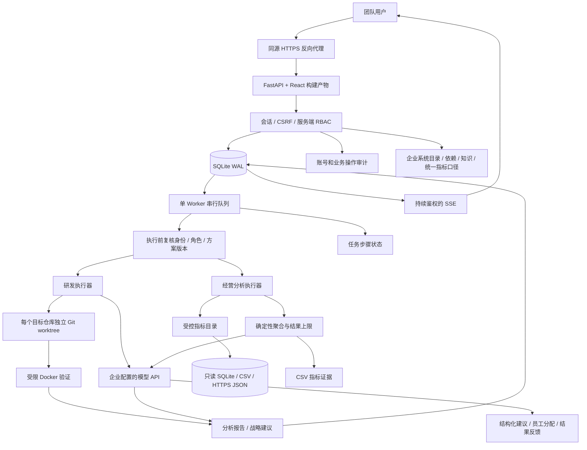

# 企业超级智能平台架构 v0.4

账号分系统管理员、普通成员。研发项目成员分负责人、开发者和只读；经营数据成员分数据负责人、分析师和只读。两套业务角色互不继承，权限由服务端检查，任务响应提供 UI 能力字段用于交互呈现。

经营分析使用 data_sources、data_source_members、metrics、analysis_jobs、analysis_events。文件数据源必须位于 `ESI_DATA_ROOTS` 白名单目录，不接受符号链接或隐藏路径；HTTPS JSON 数据源必须位于 `ESI_CONNECTOR_HOSTS` 主机白名单，按固定 URL 发起只读 GET，并受响应大小、行数、列数限制。指标预先限定表、聚合、值列、日期列和维度；模型产生的计划必须再次通过后端指标白名单校验。

enterprise_systems、system_resources、system_dependencies 维护系统图谱，knowledge_entries 保存人工确认的知识，metric_terms 与 metric_term_links 提供跨源指标术语。任务只能读取其成员对全部关联资源都有权限的系统上下文。task_projects 和 analysis_job_sources 记录任务的多个目标；创建人、审批人和查看者都必须在每个目标具备相应权限。跨源分析逐指标计算，结果标明数据源，不直接连接明细或执行跨库 JOIN。

workflow_steps 保存固定工作流的各阶段状态；现阶段由单 Worker 串行执行，步骤状态随任务状态同步。recommendations 保存模型提出的结构化建议，负责人可分配给有数据权限的员工，员工填写采纳进展和结果。建议的实际效果目前由人填写，系统尚未自动归因或评估。

所有写操作携带会话 CSRF；Cookie 为 HttpOnly、SameSite=Strict；HTTPS 部署必须 Secure。角色和账号状态不从客户端信任。项目写操作在 SQLite 写事务中重新校验权限，审批以方案版本做并发控制。SSE 在会话失效或成员移除后终止。Worker 对每轮模型调用、工具执行和验证过程重查业务授权；退出登录不等于取消已授权的后台任务，但停用/撤销权限会停止任务。

经营分析的模型调用分两段。规划阶段只提供问题和指标目录；审批后由系统生成只读聚合查询；报告阶段只提供批准方案和聚合结果。原始业务明细、服务器路径和任意 SQL 不进入模型上下文。报告和证据都保留在任务结果中，供负责人验收。

Docker 验证使用无网络、只读根、无 capabilities 和资源限制；挂载仅当前工作区，额外只读挂载 .git 文件，避免容器改写宿主机 Git 元数据入口。不存在 Docker 或镜像时失败，不会切换宿主机。只有显式 local 开发模式可以运行本地命令。

后续：ERP/CRM/数据仓库专用连接器、分页与增量同步、实体对齐和单位换算、数据脱敏策略、定时报表、可视化看板和 Office 导出；以及 OIDC/SSO、MFA、部门同步、PostgreSQL、队列与租约、多执行节点、任意步骤编排、强制双人复核、中央审计、预算配额、PR/CI 集成。当前不声称支持跨企业多租户隔离或恶意内核攻击下的完整安全边界。
